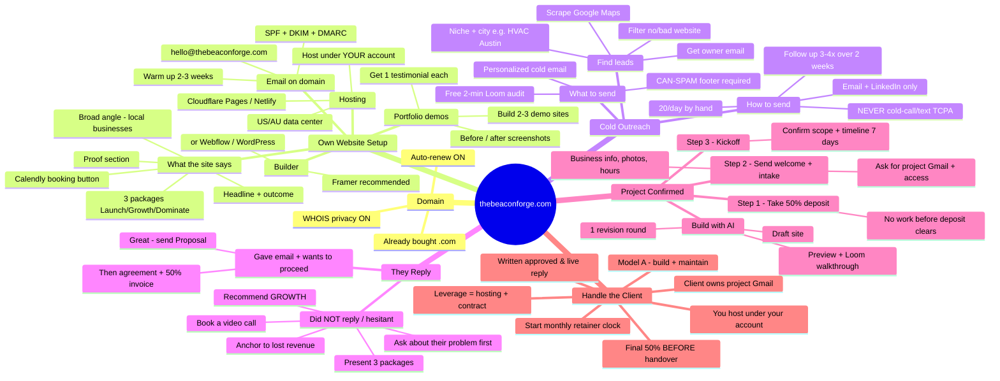

# TheBeaconForge — Agency Flow Mind Map

Visual flow from domain → own site → outreach → client onboarding. (Mermaid mindmap renders in preview.)

---

## Same flow as a linear checklist (backup if the map doesn't render)

**A. Domain** — thebeaconforge.com bought → auto-renew + WHOIS privacy on.

**B. Own website setup**
1. Builder: Framer (recommended — hosting built in) or Webflow/WordPress.
2. Hosting: Cloudflare/Netlify for static; under YOUR account; US/AU region.
3. Copy: broad angle (local businesses), headline + outcome, 3 packages, proof, Calendly button.
4. Email: `hello@thebeaconforge.com` + SPF/DKIM/DMARC, warm 2–3 weeks.
5. Demos: build **2–3** demo sites, capture before/after + 1 testimonial each.

**C. Cold outreach**
1. Scrape Google Maps (one niche + city, e.g. HVAC in Austin), filter no/bad site, get owner email.
2. Send: personalized cold email + free 2-min Loom audit + CAN-SPAM footer.
3. How: email + LinkedIn only (never cold-call/text), ~20/day, follow up 3–4× over 2 weeks.

**D. When they respond**
- **Gave email + wants to proceed** → send Proposal → then agreement + 50% deposit invoice.
- **No reply / hesitant** → book a short video call → ask their problem first → present 3 packages → recommend GROWTH → anchor price to lost revenue → close on deposit.

**E. Project confirmed — first actions**
1. Take **50% deposit** (no work before it clears).
2. Send welcome doc + intake form (business info, photos, hours) and request the **project Gmail** + access.
3. Kickoff: confirm scope + 7-day timeline.
4. Build with AI → preview + Loom walkthrough → 1 revision round.

**F. Handle the client**
- Model A (build + maintain, retainer). Client owns the project Gmail; you host under your account.
- Collect **final 50% before full handover**; get written "approved & live" reply.
- Start the monthly retainer clock. Your leverage = hosting + contract, not the Gmail login.
